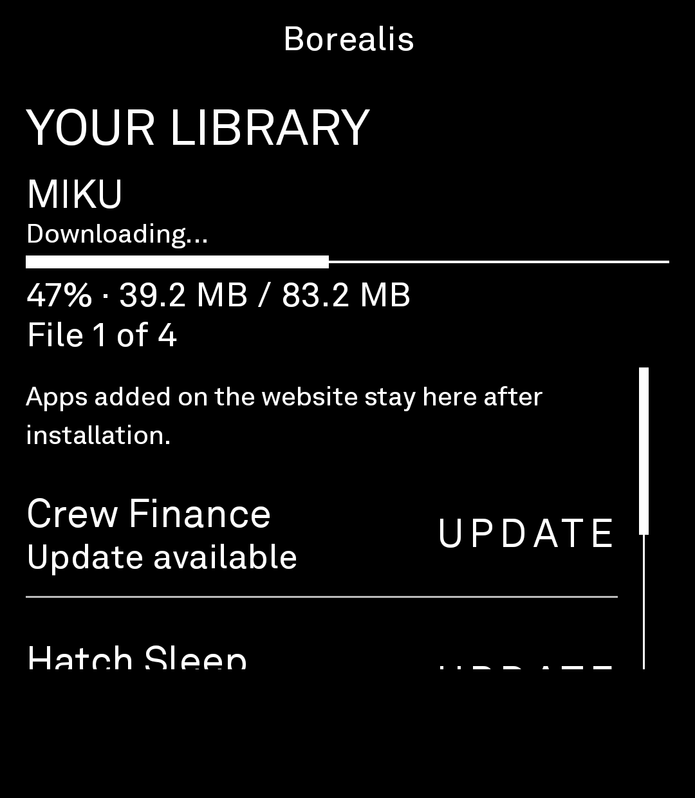
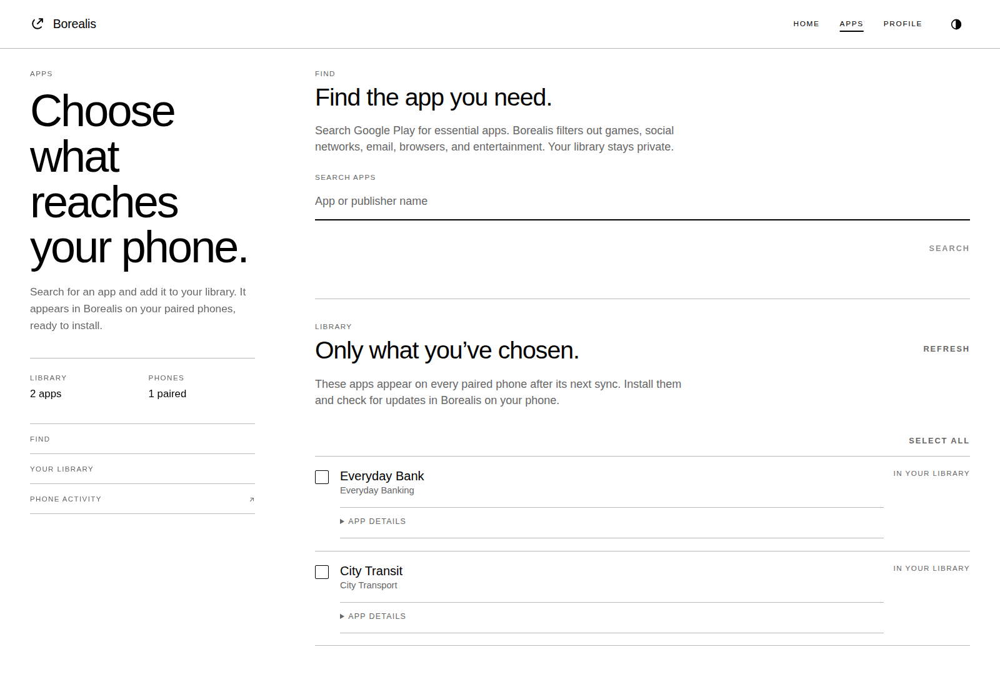

# Borealis

Borealis is an intentionally unsupported, sideload-only installer and updater for Light Phone III. Sign in on the web, search for an eligible app, and add it to your personal library. Your library appears on your paired phones, where you can install apps and see whether installed apps need updating. The phone has no store to browse: it downloads the correct Play artifacts, verifies them, and hands the complete base-and-split set to Android's installer.

This is not a Light Tool Library project and is not affiliated with Light, Aurora OSS, or Google. It constrains only the Borealis installation path; it is not a phone-wide application blocker.

## Repository layout

- `app/` — the Light SDK phone agent (`com.gav.borealis`)
- `companion/` — the hosted web companion, personal libraries, app policy, pairing, and job service
- `docs/` — trust model, protocol, and local-development notes
- `patches/` — pinned Light SDK installer changes and SDK license notice

The app consumes a custom SDK fork (by default `../light-sdk`). That fork adds the narrow `package-install-request` capability required for Android `PackageInstaller` sessions. Follow [the pinned SDK setup](patches/README.md) for a fresh checkout; an unmodified upstream SDK is not sufficient.

## Using Borealis

Borealis is Gav's centrally hosted service at [borealis.loosewire.dev](https://borealis.loosewire.dev).
Create an account, sign in, and pair your phone. Users do not configure a server
or need an admin token. There is no curator account or publisher-approval step.

On the paired phone, open `SIGN IN`. Sign in with Google so Borealis can download
and update your library apps from Google Play. Enter your details on Google's
page inside Borealis; no separately installed browser is required. Your connection
is saved securely on the phone. The companion does not collect Google credentials,
and Borealis does not store your Google password.
Use `DISCONNECT` to remove Borealis's saved Play credentials from the phone.
Once connected, the home button changes to `SIGNED IN`; tap it to manage the
saved connection without repeating sign-in.

Your Borealis username/password account is separate from this Google sign-in.
Use the companion to pair phones and manage your library. Adding an app makes it
available on every paired phone; there is no separate send or assignment step.
The phone shows Install, Up to date, Update, or an explicit unavailable-check state.
Downloads show real byte progress; verification, installation, and Android
confirmation are separate stages, not a fabricated completion percentage.

## Development and operations

- **Companion development:** see [companion/README.md](companion/README.md) for Node.js,
  pnpm, configuration, and local startup. Copy the example environment file and
  supply a private token for the contributor's local instance. Users of the
  hosted service sign up with a username and password,
  without email. Better Auth 1.7.6 manages password authentication and sessions;
  its internal `username@users.borealis.invalid` aliases are never emailed.
  Keep the database and signing material private.
- **Phone app:** requires JDK 17, Android SDK 36, and the pinned, patched Light SDK.
  Configure your Android SDK path locally, then use the included Gradle wrapper.
  The companion URL defaults to the emulator address `http://10.0.2.2:8787`;
  use `-Pborealis.companionUrl=https://your-companion.example` for a hosted instance.
- **Hosting:** the production companion is live at
  `https://borealis.loosewire.dev` on Cloudflare Workers Free with Turso, without
  an explicit CPU override. Cloudflare's
  native GitHub integration will build and deploy companion changes from `main`
  once connected in the dashboard;
  GitHub Actions handles checks and Android releases. See the
  [deployment runbook](docs/deployment.md) for credentials, migrations, and
  verification and the separate native GitHub connection step.
- **Distribution:** [GitHub Actions and signed releases](docs/releases.md) build
  against the pinned, patched SDK on hosted runners. Release builds require the
  dedicated Borealis signing key and production HTTPS URL. Releases start as
  reviewable drafts; public publication is an explicit release step. The
  [BrightMarket release kit](store/brightmarket/README.md) contains listing copy,
  metadata, icon, screenshots, and the submission checklist.

## Screenshots

Phone screenshots show actual LP3 behavior. Companion screenshots use fictional
demo data in the real web UI; they are not examples of guaranteed app availability.

See [all screenshots and capture details](store/brightmarket/README.md#screenshots).

## Development status

The first vertical slice is under active construction:

1. Create an account and pair a phone with the companion.
2. Search eligible Play apps and add them to your private library.
3. Sync that library to the phone and choose Install or Update.
4. Request and verify a signed, device-bound job on the phone.
5. Fetch the current device-specific base and splits directly from Google Play.
6. Verify package identity, signer, size, and hashes, then request installation.
7. Report the final result to the companion and periodically check for updates.

The personal-library flow has passed phone unit tests and compilation, companion
unit tests and typechecks, and fixture-based browser flows. On 2026-09-27,
alpha.4 completed MIKU's real download and installation on an LP3, and the app
then showed Up to date. Actual updates of existing third-party apps remain to test.
App admission uses server-side
Play-category filtering and targeted email/browser exclusions, not human approval.
This automatic policy is a best-effort filter, not a guarantee that every app in
an eligible category fits the philosophy. Accounts, libraries, and phones stay isolated.

The Better Auth migration was applied to production on 2026-09-26 after a private
backup. Existing account IDs, roles, password hashes, phone ownership, and exact
signing-key bytes were verified unchanged. Browsers must sign in again; Better Auth
uses opaque session tokens and signed cookies. Wrangler deployment to Workers Free
and hosted HTTPS account, pairing, and signed-job checks passed; temporary fixtures
were cleaned. Legacy-password production signin and the native GitHub build
connection remain unverified. See the
[deployment runbook](docs/deployment.md) for session-secret handling and remaining checks.

On alpha.3 the LP3 completed Google authentication, securely saved the reusable
credential, reused it successfully, and downloaded MIKU to the old publisher-review
gate. Alpha.4 removed that gate and completed the MIKU installation, with Android
identifying Borealis as its installer. This experimental flow is not
supported Google OAuth, and future Google behavior can change.

Borealis is one shared hosted service where each person logs in and
pairs their own phones. Turso is the chosen hosted SQLite provider (replacing
the earlier D1 proposal). The companion supports a Turso/libSQL connection.
The Worker adapter, edge rate limits, and release automation are separate from
physical phone validation. See [deployment](docs/deployment.md),
[accounts](companion/README.md#accounts), and
[database setup](companion/README.md#turso-database).

## Low-resource development

This development machine is resource constrained. Run only one build or test
command at a time, including builds in adjacent projects. Prefer targeted,
incremental checks; avoid `clean`, full SDK test suites, emulators, and overlapping
watch servers unless the task actually needs them.

The phone build defaults to one Gradle worker, no parallel tasks, a 1536 MiB JVM
heap, and in-process Kotlin compilation. Gradle's JVM sees at most two processors
to limit internal compiler/GC concurrency. Persistent Gradle daemons are disabled
(Gradle can still use a short-lived single-use daemon for a build). These are
per-process limits, not a hard total-memory cap for all Android build tools.

Companion tests also use one worker with parallel files disabled. Avoid running
them alongside the Android build. Stop task-owned development servers when done.
Run expensive checks at lower scheduling priority where practical, for example
`nice -n 10 ./gradlew :app:testDebugUnitTest --console=plain`.

## Licensing

Borealis is intended to be distributed under GPL-3.0-or-later because the phone client uses Aurora OSS `gplayapi`, which is GPL-family software. Preserve upstream notices and provide corresponding source whenever distributing binaries.
